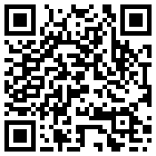

<!--
title: 第六课：更新最近博文
description: 《“个人网站”开发实战》第六课：更新最近博文。本堂课我们要用学习在 JavaScript 开发中使用模板。前端越来越多地承载业务逻辑，选用合适的模板工具，甚至进行数据双向绑定是必然方向。这回我们先学习使用 Handlebars 进行简单的渲染。
keywords: git
thumbnail: http://qiniu.meathill.com/wp-content/uploads/2017/02/20150605_123237000_iOS-768x576.jpg
-->

### “个人网站”开发实战 第六课
# 更新最近博文

### 讲师：翟路佳

--------

| 教程二维码 | 本节课二维码 |
|----|----|
|  |  |
<!-- .element: class="t-a-c" -->

--------

## 本节课程大纲

本节课以开发为主，这里简单罗列下用到的语言要素。

1. Ajax
2. Handlebars
3. localStorage

--------

## Ajax

[`jQuery.ajax()`](http://api.jquery.com/jQuery.ajax/)

```javascript
jQuery.ajax({
  url: 'http://blog.meathill.com/rss2',
  dataType: 'xml',
  success(response) {
    // 渲染
  }
});
```

--------

## Handlebars

[官方网站](http://Handlebarsjs.com/)

```html
<script id="entry-template" type="text/x-handlebars-template">
  <div class="entry">
    <h1>{{title}}</h1>
    <div class="body">
      {{body}}
    </div>
  </div>
</script>
```

```javascript
var source = $("#entry-template").html();
var template = Handlebars.compile(source);
```

--------

## localStorage

[文档](https://developer.mozilla.org/en-US/docs/Web/API/Storage/LocalStorage)

```javascript
// 保存数据
localStorage.setItem("username", "John");

// 读取数据
alert( "username = " + localStorage.getItem("username"));
```

--------

### 开发“最新博文”